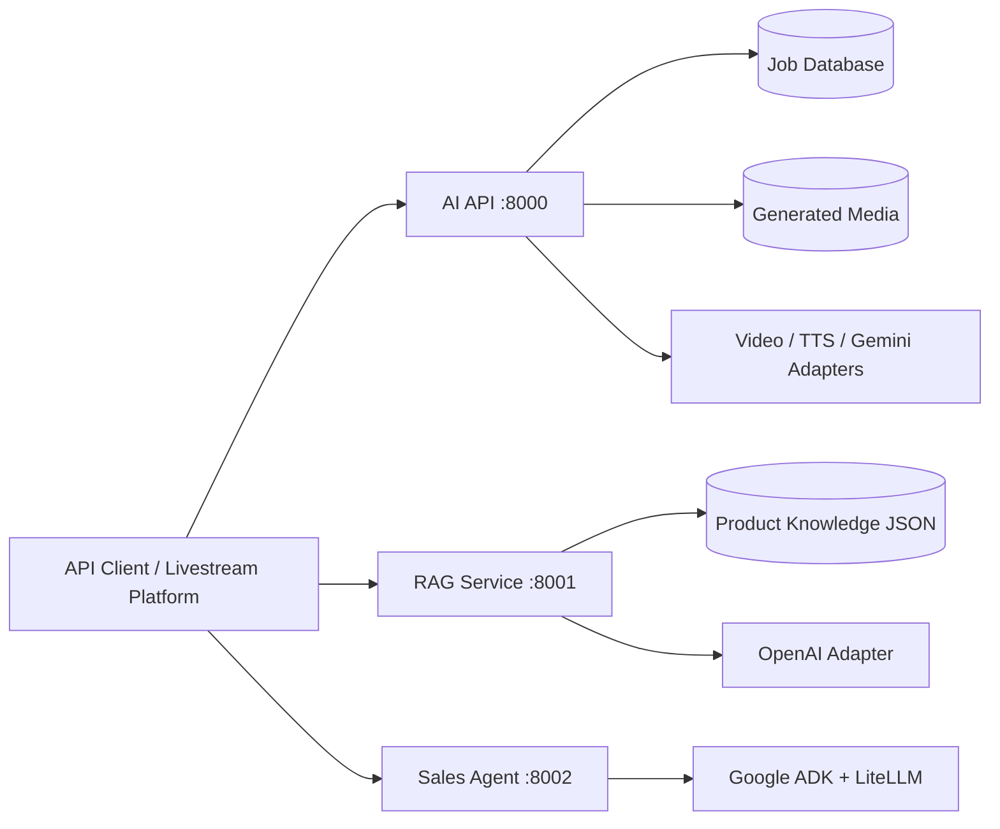

# AI Live-Commerce Platform

A service-oriented AI backend for live-commerce automation. The repository
demonstrates three different AI engineering workloads behind explicit service
boundaries:

- **AI API**: job orchestration for video generation, speech synthesis, media
  storage, and real-time WebSocket delivery.
- **RAG service**: deterministic comment classification, TF-IDF retrieval, and
  grounded presenter-script generation.
- **Sales agent**: a stateful Google ADK agent that collects order information
  and falls back to a secondary model provider when the primary quota is
  exhausted.

The codebase is intentionally backend-only. Experimental notebooks, duplicated
frontend projects, generated UI scripts, and copied service trees have been
removed. The only notebook retained is the operational Colab host for the GPU
AI API.

## Architecture



Each Python service follows the same dependency direction:

```text
API transport -> application use cases -> domain ports and models
                                      <- infrastructure adapters
```

Domain and application code do not import FastAPI, SQLAlchemy, OpenAI, or
Google ADK. Provider and persistence decisions are assembled at the service
composition root.

## Repository Layout

```text
services/
  ai_api/          Clean Architecture media orchestration service
  rag_service/     Retrieval and grounded script generation service
  sales_agent/     Stateful conversational sales agent
tests/
  unit/            Pure policy, adapter, and use-case tests
  integration/     HTTP + dependency injection + database tests
requirements/      Dependency set per deployable service
notebooks/
  ai_service_colab.ipynb
docs/              Architecture, AI design, API, and development guides
```

## Quick Start
# 🎬 AI Service Backend

**Video Generation & Text-to-Speech API** with real-time WebSocket streaming — built with FastAPI and Clean Architecture.

<table>
  <tr>
    <td align="center"><b>Demo 1</b></td>
    <td align="center"><b>Demo 2</b></td>
    <td align="center"><b>Demo 3</b></td>
  </tr>
  <tr>
    <td align="center">
      <video src="https://github.com/user-attachments/assets/a47cb5cc-34f1-4cce-8176-a9c7fe0a065e" width="260" controls></video>
    </td>
    <td align="center">
      <video src="https://github.com/user-attachments/assets/61c010e1-77cd-4f3b-bb16-60e1802ce8e3" width="260" controls></video>
    </td>
    <td align="center">
      <video src="https://github.com/user-attachments/assets/4704ca9f-31ed-4a19-84b1-e3fd849fe8e3" width="260" controls></video>
    </td>
  </tr>
</table>


## ✨ Features

- 🎥 **Video Generation** — Generate videos from text prompts (pluggable model backends)
- 🔊 **Text-to-Speech** — Synthesize speech with real-time audio streaming
- ⚡ **WebSocket Streaming** — Receive chunks in real-time (frame-by-frame video, audio segments)
- 🌐 **Website Integration** — CORS-enabled REST + WebSocket APIs for frontend integration
- 🏗️ **Clean Architecture** — Domain-driven design with dependency inversion
- 🔐 **API Key Auth** — Secure endpoints with API key authentication
- 📊 **Job Tracking** — Track AI processing jobs with status and progress
- 🐳 **Docker Ready** — Multi-stage Dockerfile with docker-compose

## 🚀 Quick Start

### 1. Setup

```bash
python -m venv .venv
.venv\Scripts\activate
pip install -r requirements.txt
copy .env.example .env
```

Run services in separate terminals:

```bash
uvicorn services.ai_api.main:app --reload --port 8000
uvicorn services.rag_service.main:app --reload --port 8001
uvicorn services.sales_agent.main:app --reload --port 8002
```

Or run the complete backend stack:
uvicorn app.main:app --reload --host 0.0.0.0 --port 8000
```

For `/api/v1/video/livestream/jobs`, install `ffmpeg` on the host. Set
`LIVESTREAM_ENABLE_WAV2LIP=true` only after Wav2Lip and its checkpoint exist.

### 3. Explore the API

- **Swagger UI**: http://localhost:8000/docs
- **Health Check**: http://localhost:8000/health

## 📡 WebSocket Usage

### Video Generation (Real-time Streaming)

```javascript
const ws = new WebSocket('ws://localhost:8000/ws/video/generate');

// 1. Authenticate
ws.onopen = () => {
  ws.send(JSON.stringify({
    type: 'authenticate',
    api_key: 'your-api-key'
  }));
};

// 2. Send generation request after auth
ws.onmessage = (event) => {
  const msg = JSON.parse(event.data);
  
  if (msg.type === 'authenticated') {
    ws.send(JSON.stringify({
      type: 'generate',
      prompt: 'A cat walking in a park',
      config: { width: 512, height: 512, num_frames: 16 }
    }));
  }
  
  if (msg.type === 'progress') {
    console.log(`Progress: ${msg.percent}% — ${msg.stage}`);
  }
  
  if (msg.type === 'frame_chunk') {
    // Decode base64 frame data and render
    const frameData = atob(msg.data);
    console.log(`Frame ${msg.frame_idx}/${msg.total_frames}`);
  }
  
  if (msg.type === 'complete') {
    console.log('Video ready:', msg.url);
  }
  
  if (msg.type === 'error') {
    console.error(`Error [${msg.code}]: ${msg.message}`);
  }
};
```

### Text-to-Speech (Real-time Audio Streaming)

```javascript
const ws = new WebSocket('ws://localhost:8000/ws/tts/stream');

ws.onopen = () => {
  ws.send(JSON.stringify({ type: 'authenticate', api_key: 'your-api-key' }));
};

ws.onmessage = (event) => {
  const msg = JSON.parse(event.data);
  
  if (msg.type === 'authenticated') {
    ws.send(JSON.stringify({
      type: 'synthesize',
      text: 'Xin chào, đây là demo text-to-speech.',
      voice: 'vi-female-01',
      format: 'wav'
    }));
  }
  
  if (msg.type === 'audio_chunk') {
    // Decode and play audio chunk immediately
    const audioData = atob(msg.data);
    console.log(`Audio chunk ${msg.chunk_idx}, ${msg.duration_ms}ms`);
    // Feed to AudioContext for real-time playback
  }
  
  if (msg.type === 'complete') {
    console.log(`Done: ${msg.total_chunks} chunks, ${msg.duration_ms}ms total`);
  }
};
```

## 🏗️ Architecture

```
app/
├── api/           # Presentation Layer (REST + WebSocket endpoints)
│   ├── schemas/   # Pydantic request/response models
│   ├── deps.py    # Dependency injection wiring
│   ├── middlewares/
│   └── v1/        # Versioned endpoints
│       ├── endpoints/
│       └── websockets/
├── application/   # Application Layer (Use Cases)
│   ├── dto/       # Data Transfer Objects
│   └── use_cases/ # Business logic orchestrators
├── domain/        # Domain Layer (Pure Business Logic)
│   ├── entities/  # Core data objects
│   ├── enums/     # Status codes, types
│   ├── exceptions/# Domain errors
│   └── interfaces/# Abstract ports (ABCs)
├── infrastructure/# Infrastructure Layer (Adapters)
│   ├── ai_models/ # AI model adapters (plug your model here)
│   ├── persistence/# Database (SQLAlchemy)
│   ├── storage/   # File storage (local/S3)
│   ├── cache/     # Redis cache
│   └── queue/     # Task management
├── core/          # Cross-cutting Concerns
│   ├── logging.py
│   ├── security.py
│   ├── ws_manager.py
│   └── events.py
├── config.py      # Pydantic Settings
└── main.py        # App factory + lifespan
```


## 🔌 Plugging in Real AI Models

The mock adapters in `app/infrastructure/ai_models/` can be replaced with real model implementations:

1. **Video**: Implement `IVideoService` in `video_generator.py` using your model (CogVideoX, Wan, etc.)
2. **TTS**: Implement `ITTSService` in `tts_engine.py` using your model (XTTS, Bark, etc.)
3. Update `app/api/deps.py` to instantiate your real adapter instead of the mock

## 🧪 Testing

```bash
docker compose up --build
```

OpenAPI is available at `/docs` when debug mode is enabled. The RAG and sales
services expose docs by default; set `AI_API_DEBUG=true` for AI API docs.

## Quality Gates

```bash
ruff check services tests
pytest -q
```

Tests replace external model providers with fakes and override the FastAPI
database dependency with an isolated in-memory SQLite engine. No API key or
network request is required for the automated suite.

## Documentation

- [System architecture](docs/architecture.md)
- [AI and agent engineering](docs/ai-engineering.md)
- [API contracts](docs/api-reference.md)
- [Development and extension guide](docs/development.md)
- [Colab GPU deployment](docs/colab-deployment.md)

# Build and run
docker-compose up --build

# Run with GPU support (uncomment GPU section in docker-compose.yml)
docker-compose up --build
```

## 📋 API Endpoints

| Method | Path | Description |
|--------|------|-------------|
| GET | `/health` | Liveness probe |
| GET | `/readiness` | Readiness probe (checks AI models) |
| POST | `/api/v1/video/generate` | Generate video (batch) |
| POST | `/api/v1/video/livestream/jobs` | Upload host/product images and create a micro-scene livestream video job |
| GET | `/api/v1/video/livestream/jobs/{job_id}/outputs` | Get scene clips and final livestream video URL |
| GET | `/api/v1/video/config` | Get supported video config |
| POST | `/api/v1/tts/synthesize` | Synthesize speech (batch) |
| GET | `/api/v1/tts/voices` | List available voices |
| GET | `/api/v1/jobs/{job_id}` | Get job status |
| WS | `/ws/video/generate` | Video generation (streaming) |
| WS | `/ws/tts/stream` | TTS synthesis (streaming) |

TEST-WRAP-PIPELINE

python tests/wraptest.py                          # Full pipeline
python tests/wraptest.py --step generate-script   # Chỉ tạo script
python tests/wraptest.py --provider local         # Dùng fallback rule-based
