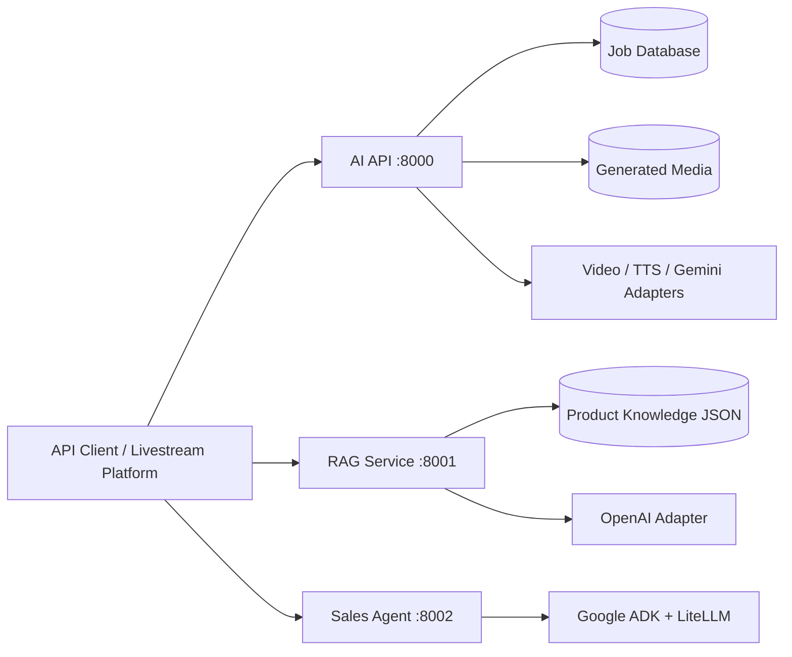

# AI Live-Commerce Platform

A service-oriented AI backend for live-commerce automation. The repository
demonstrates three different AI engineering workloads behind explicit service
boundaries:

- **AI API**: job orchestration for video generation, speech synthesis, media
  storage, and real-time WebSocket delivery.
- **RAG service**: deterministic comment classification, TF-IDF retrieval, and
  grounded presenter-script generation.
- **Sales agent**: a stateful Google ADK agent that collects order information
  and falls back to a secondary model provider when the primary quota is
  exhausted.

The codebase is intentionally backend-only. Experimental notebooks, duplicated
frontend projects, generated UI scripts, and copied service trees have been
removed. The only notebook retained is the operational Colab host for the GPU
AI API.

## Architecture



Each Python service follows the same dependency direction:

```text
API transport -> application use cases -> domain ports and models
                                      <- infrastructure adapters
```

Domain and application code do not import FastAPI, SQLAlchemy, OpenAI, or
Google ADK. Provider and persistence decisions are assembled at the service
composition root.

## Repository Layout

```text
services/
  ai_api/          Clean Architecture media orchestration service
  rag_service/     Retrieval and grounded script generation service
  sales_agent/     Stateful conversational sales agent
tests/
  unit/            Pure policy, adapter, and use-case tests
  integration/     HTTP + dependency injection + database tests
requirements/      Dependency set per deployable service
notebooks/
  ai_service_colab.ipynb
docs/              Architecture, AI design, API, and development guides
```

## Quick Start

```bash
python -m venv .venv
.venv\Scripts\activate
pip install -r requirements.txt
copy .env.example .env
```

Run services in separate terminals:

```bash
uvicorn services.ai_api.main:app --reload --port 8000
uvicorn services.rag_service.main:app --reload --port 8001
uvicorn services.sales_agent.main:app --reload --port 8002
```

Or run the complete backend stack:

```bash
docker compose up --build
```

OpenAPI is available at `/docs` when debug mode is enabled. The RAG and sales
services expose docs by default; set `AI_API_DEBUG=true` for AI API docs.

## Quality Gates

```bash
ruff check services tests
pytest -q
```

Tests replace external model providers with fakes and override the FastAPI
database dependency with an isolated in-memory SQLite engine. No API key or
network request is required for the automated suite.

## Documentation

- [System architecture](docs/architecture.md)
- [AI and agent engineering](docs/ai-engineering.md)
- [API contracts](docs/api-reference.md)
- [Development and extension guide](docs/development.md)
- [Colab GPU deployment](docs/colab-deployment.md)
